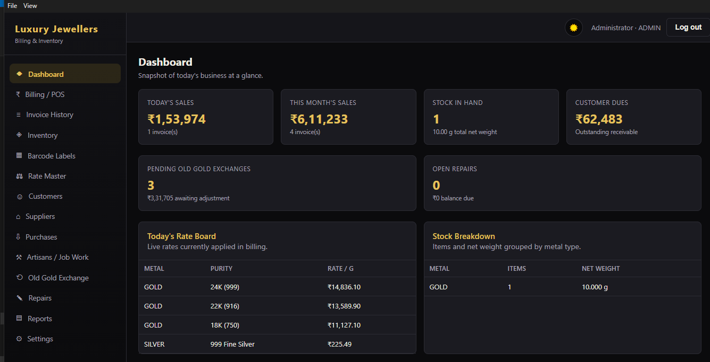
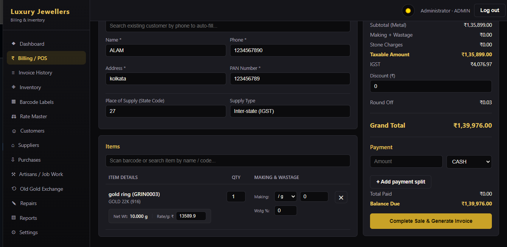
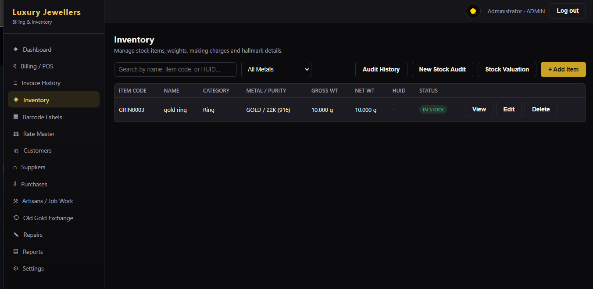
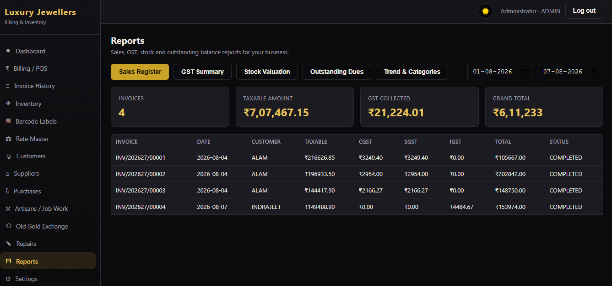

# Luxury Jewellers ERP

**Professional Billing & Inventory Management System for Indian Jewellery Retailers**

[](your-download-link)
[](https://www.microsoft.com/windows)
[](https://www.cbic.gov.in/)
[](#license)

> **A powerful, offline-first desktop application built specifically for Indian jewellery shops. No internet. No subscriptions. No hassles.**

Transform your jewellery retail business with professional billing, real-time inventory tracking, GST-compliant invoicing, and financial reports—all running securely on your local computer.

---

## 🎯 What This Does

| Feature | Benefit |
|---------|---------|
| **GST-Compliant Billing** | Create tax invoices with automatic CGST/SGST/IGST calculations |
| **Inventory Tracking** | Manage stock with HUID/hallmark support, weight, and purity |
| **Real-Time Reports** | Sales, GST summaries, stock valuation, outstanding dues |
| **Customer Management** | Track customers, payment history, and account ledgers |
| **Supplier & Purchases** | Record bills, manage payables, auto-update inventory |
| **Job Work / Karigar** | Issue metal, track wastage, manage artisan payments |
| **Old Gold Exchange** | Record trade-ins, calculate melting deductions |
| **Repair Management** | Track repair tokens, delivery dates, payments |
| **100% Offline** | No internet required, all data stays on your computer |
| **Easy Backups** | One-click backup to USB or cloud storage |

---

## 🎥 Video Demo

**Watch the full walkthrough:**

[](https://youtube.com/watch?v=YOUR_VIDEO_ID)

*Click above to watch a 5-minute demo showing billing, inventory, and reports in action.*

---

## 📸 Screenshots

### Dashboard


### GST-Compliant Invoice


### Real-Time Inventory


### Financial Reports


---

## ✨ Why Choose Luxury Jewellers ERP?

✅ **Built for Indian Jewellery Shops** — Understands GST, HUID, hallmarks, making charges  
✅ **Offline & Secure** — Your data never leaves your computer  
✅ **Professional Invoicing** — Generates tax-ready PDF invoices instantly  
✅ **No Subscriptions** — One-time purchase, no monthly fees  
✅ **Ease to Use** — Intuitive interface, no technical knowledge needed  
✅ **Works on Any Windows PC** — No special software required  
✅ **Automatic Backups** — Keep your data safe with one-click backup  

---

## 🚀 Quick Start

### **1. Download & Install**

👉 **[Download Latest Version Here](your-download-link)**

- Simply download the `.exe` file
- Run it on your Windows 10/11 computer
- Follow the installer steps
- Takes 2 minutes

### **2. First Login**

```
Username: admin
Password: [Contact us for credentials]
```

**[Request Login Credentials](mailto:contact@your-business.com)**

### **3. Start Using**

- Set up your shop details
- Enter today's gold/silver rates
- Create your first invoice
- That's it!

---

## 📋 Features Overview

### **Billing & Invoicing**
- Create GST tax invoices in seconds
- Automatic calculation of CGST, SGST, IGST
- Per-item making charges and wastage tracking
- Old-gold credits and scheme redemptions
- Split payments (cash, check, card, etc.)
- Professional PDF invoice printing

### **Inventory Management**
- Complete item master with weight, purity, HUID
- Real-time stock tracking with full audit trail
- Stock valuation at current market rates
- Barcode support for quick searches

### **Rate Master**
- Daily gold/silver/platinum rate entry
- Per-purity rates
- Historical rate tracking
- Automatic application to invoices

### **Customer & Supplier Management**
- Customer database with contact info
- Running account ledgers
- Outstanding dues tracking
- Supplier payables management

### **Financial Reports**
- Sales register (daily/monthly/yearly)
- GST summary for GSTR-1 filing
- Stock valuation report
- Outstanding receivables & payables
- Artisan payment statements

### **Data Security**
- Fully offline operation
- Local SQLite database
- Regular backups to USB or cloud
- Password-protected access
- Complete audit trail

---

## 🔐 Security & Privacy

- ✅ **100% Offline** — No internet connection needed
- ✅ **Your Data, Your Computer** — Nothing uploaded to servers
- ✅ **Secure Backups** — Easy backup to USB or Google Drive
- ✅ **No Subscriptions** — No recurring charges, no tracking
- ✅ **Professional Grade** — Enterprise-level security

---

## 💻 System Requirements

- **Windows 10 or Windows 11** (64-bit)
- **4 GB RAM** (8 GB recommended)
- **500 MB free disk space**
- **Administrator access** for installation

---

## 📖 Documentation

- **[Installation Guide](docs/INSTALLATION.md)** — Step-by-step setup instructions
- **[User Guide](docs/USER_GUIDE.md)** — How to use all features
- **[FAQ](docs/FAQ.md)** — Common questions answered

---

## 🎓 Who Should Use This?

✅ **Jewellery Shops** — Perfect for retail stores  
✅ **Jewellers & Artisans** — Track your inventory and sales  
✅ **Franchise Owners** — Manage multiple locations  
✅ **Shop Managers** — Run daily operations efficiently  
✅ **Accountants** — Generate GST-ready reports  

---

## 📞 Support & Contact

**Questions? Need help? Want a demo?**

📧 **Email:** contact@your-business.com  
📱 **Phone:** your-phone-number  
🌐 **Website:** your-website.com  

---

## 📄 License

**Proprietary License** — All rights reserved.

This software is licensed for use on a single computer. Redistribution, resale, or commercial use is strictly prohibited without permission.

See [LICENSE](LICENSE) file for full terms.

---

## 🛠️ Technical Stack

Built with:
- **Electron** — Desktop application framework
- **React + Vite** — Modern, fast UI
- **SQLite** — Reliable local database
- **Node.js** — Powerful backend
- **pdfkit** — Professional PDF generation

---

## 💡 About

Luxury Jewellers ERP is designed by jewellery retail experts to solve real problems in Indian jewellery shops. Every feature is built based on actual shop workflows.

**Created with ❤️ for Indian jewellery businesses**

---

**Version 1.0.0** | Last Updated: August 2026

**Ready to transform your jewellery shop?** → [Download Now](your-download-link)

---

## 📋 Features & Modules

| Module | Capabilities |
|--------|--------------|
| **Billing / POS** | GST-compliant invoicing with live CGST/SGST/IGST calculation • Per-item making charges & wastage tracking • Old-gold credit and scheme redemption • Split & multiple payment methods • Real-time inventory deduction • PDF invoice generation & printing |
| **Inventory Management** | Complete item master with gross/net weight & purity specifications • Stone details and HUID hallmark tracking • Real-time stock ledger with full audit trail • Stock valuation at current market rates • Barcode support for item tracking |
| **Rate Master** | Daily precious metal rates (gold, silver, platinum) per purity • Historical rate tracking • Automatic rate application to sales & valuations |
| **Customer Management** | Complete customer database with contact details • Running account ledger & payment history • Outstanding dues tracking • Customer search and segmentation |
| **Supplier & Purchase Management** | Purchase order & bill recording • Automatic inventory stock updates • Supplier-wise payable ledger • Purchase history and price tracking |
| **Job Work / Karigar** | Issue raw metal to goldsmiths for processing • Receipt of finished items • Automatic wastage calculation • Making charge payable tracking |
| **Old Gold Exchange** | Trade-in recording with tested purity • Melting deduction calculations • Redeemable credit application or cash settlement |
| **Repair Management** | Repair token creation and tracking • Expected delivery dates • Advance payment recording • Status tracking (ready/delivered) • Balance due calculation |
| **Business Reports** | Sales register by date range • GST summary (HSN-wise) for GSTR-1 filing • Stock valuation report • Outstanding receivables/payables • Artisan payment statements |
| **Settings & Administration** | Shop profile & GSTIN configuration • HSN code & GST rate master • Product categories • Multi-user support with role-based access • Database backup & restore • User audit log |

**All calculations are formula-based and verified** — see [`src/main/utils/gst.js`](src/main/utils/gst.js) and [`src/main/utils/pricing.js`](src/main/utils/pricing.js) for details. No mock or placeholder data.

On first launch, the app seeds official **CBIC HSN codes and GST rates for jewellery** (HSN 7113, 7108, 7106, 7118, 9988) and standard purity definitions. **You can start billing immediately, but verify all GST rates against the current CBIC notification for your state** before going live. Rates are configurable in Settings.

---

## 🏗️ Project Architecture

```
luxury-jewellers-erp/
├── package.json                  # Electron app config, build settings (electron-builder)
├── build/                        # Windows installer assets (icon.ico, etc.)
├── release/                      # Build output (*.exe installer, unpacked app)
├── backups/                      # Database backup storage
│
├── src/main/                     # Electron main process (Node.js backend, runs on host machine)
│   ├── main.js                   # Application entry point, window lifecycle, menu setup
│   ├── preload.js                # Secure contextBridge API exposed to React frontend
│   │
│   ├── database/
│   │   ├── db.js                 # SQLite connection, schema initialization, seed data
│   │   ├── schema.sql            # Complete relational schema (all modules)
│   │   └── migrations/           # Future schema migration scripts
│   │
│   ├── services/                 # Business logic layer (one service per module)
│   │   ├── authService.js        # User authentication, password management
│   │   ├── billingService.js     # Invoice creation, GST calculation, stock & ledger updates
│   │   ├── inventoryService.js   # Item master, stock tracking, valuations
│   │   ├── purchaseService.js    # Purchase order & bill processing
│   │   ├── karigarService.js     # Job work and artisan payment tracking
│   │   ├── oldGoldService.js     # Trade-in & exchange management
│   │   ├── customerService.js    # Customer database & ledger
│   │   ├── supplierService.js    # Supplier management & payables
│   │   ├── rateService.js        # Precious metal rate management
│   │   ├── repairService.js      # Repair job tracking
│   │   ├── reportService.js      # Financial and operational reports
│   │   ├── settingsService.js    # Configuration and system settings
│   │   ├── backupService.js      # Database backup & restore
│   │   ├── invoicePdfService.js  # Tax invoice PDF generation (pdfkit)
│   │   ├── auditPdfService.js    # Audit report PDF generation
│   │   └── notificationService.js# System notifications
│   │
│   ├── ipc/
│   │   └── ipcHandlers.js        # Registers all IPC channels (ipcMain.handle)
│   │
│   └── utils/
│       ├── gst.js                # GST calculation engine (CGST/SGST/IGST logic)
│       ├── pricing.js            # Price computation (making charges, wastage, etc.)
│       └── numberSequence.js     # Financial year-based document numbering
│
└── renderer/                     # React frontend (Vite bundler, runs in app window)
    ├── index.html                # HTML template
    ├── vite.config.js            # Vite build configuration
    └── src/
        ├── main.jsx              # React app entry point
        ├── App.jsx               # Main app routing & layout
        │
        ├── context/              # React Context API providers
        │   ├── AuthContext.jsx   # User authentication state
        │   └── ToastContext.jsx  # Toast notifications
        │
        ├── components/           # Reusable UI components
        │   ├── Layout.jsx        # Main layout wrapper
        │   └── Modal.jsx         # Modal dialog component
        │
        ├── pages/                # Page components (one folder per module)
        │   ├── Login/
        │   ├── Dashboard/
        │   ├── Billing/
        │   ├── Inventory/
        │   ├── Customers/
        │   ├── Suppliers/
        │   ├── Artisans/
        │   ├── OldGold/
        │   ├── Repairs/
        │   ├── Purchases/
        │   ├── RateMaster/
        │   ├── Reports/
        │   └── Settings/
        │
        ├── styles/
        │   └── theme.css         # Global styles (luxury black & gold theme)
        │
        └── utils/                # Frontend utilities
```

**Architecture Highlights:**
- **Clear separation of concerns:** Business logic in services, UI in React components
- **IPC bridge:** Secure communication between frontend (React) and backend (Node.js)
- **No external API dependency:** All data stored in local SQLite database
- **Modular services:** Each business domain in a separate service file for easy testing and extension

## 💻 System Requirements & Installation

### Prerequisites

- **Node.js 20 LTS or later** — [Download](https://nodejs.org/)
- **Windows 10/11** (64-bit recommended)
- **4 GB RAM minimum** (8 GB recommended)
- **500 MB disk space** for installation and database

> **Important:** The app uses `better-sqlite3`, a native Node.js module compiled for Windows. Running `npm install` on the Windows machine will automatically download and use the correct prebuilt binary. Do not copy `node_modules` from other operating systems to Windows.

### Development Setup

```bash
# Clone the repository
git clone <repository-url>
cd luxury-jewellers-erp

# Install dependencies
npm install

# Start development server with hot reload
npm run dev
```

The app will launch with Vite dev server and Electron pointed to it. Database is created automatically at:
```
%APPDATA%\luxury-jewellers-erp\data\luxury_jewellers.db
```

**Default Login Credentials:**
```
Username: admin
Password: admin123
```

⚠️ **Change the default password immediately** after first login via **Settings → Users → Change My Password**.

### Production Build

```bash
# Build the installer for Windows
npm install
npm run dist:win
```

This generates a professional NSIS installer at:
```
release/Luxury Jewellers Setup <version>.exe
```

The installer:
- Creates a desktop shortcut
- Adds a Start Menu entry
- Stores the database in `%APPDATA%\luxury-jewellers-erp\data\`
- Can be uninstalled via Windows Settings → Apps

To create an unpacked test build without an installer:
```bash
npm run pack
```

---

## 🚀 Quick Start Guide

### 1. Set Shop Details and Rates

On first launch:
1. Log in with default credentials (`admin` / `admin123`)
2. Go to **Settings → Shop Profile** and enter:
   - Shop name and GSTIN
   - Address and contact details
   - State code (for GST compliance)
3. Go to **Rate Master** and enter today's gold/silver/platinum rates for each purity
4. Change your password immediately

### 2. Create Your First Sale

**Billing / POS** workflow:
1. Click **New Invoice**
2. Search for or scan an item from your inventory (or add a new item on-the-fly)
3. Adjust making charges, wastage percentage, or quantity as needed
4. Optionally apply old-gold exchange credit or customer scheme redemption
5. Select payment method (cash, check, card, etc.)
6. Click **Complete Sale** — the system calculates GST automatically
7. Print the PDF tax invoice from the invoice detail page

### 3. Manage Your Inventory

- **Inventory → New Item:** Add items to the master with weight, purity, HUID, stone details
- **Inventory → Stock Ledger:** View complete audit trail of stock movements
- **Inventory → Stock Valuation:** See inventory value at today's rates

### 4. Record Purchases and Payables

**Suppliers & Purchases:**
1. Click **New Purchase Bill**
2. Select or create a supplier
3. Add items with rate and quantity
4. The system automatically credits inventory and updates supplier's payable ledger
5. Record payments to suppliers anytime

### 5. Backup Your Data Regularly

Go to **Settings → Backup & Restore → Backup Now** and save to:
- An external USB drive, or
- A cloud-synced folder (Google Drive, OneDrive, Dropbox, etc. desktop app)

For added safety, set up automated backups using Windows Task Scheduler.

---

## 📊 Financial & Compliance Features

### GST Computation
- Automatic CGST/SGST calculation for intra-state sales
- Automatic IGST calculation for inter-state sales
- Based on HSN codes configured in Settings
- Compliant with current CBIC notifications (verify before going live)

### Inventory Valuation
- FIFO (first-in, first-out) cost calculation
- Real-time valuation at current market rates
- Full audit trail of all stock movements

### Document Numbering
- Automatic invoice, purchase, job work, and exchange numbers
- Resets on 1 April (Indian financial year)
- Format: `INV/2526/00001`, `PUR/2526/00001`, etc.

### Reports for Compliance
- **Sales Register:** By date range, HSN-wise
- **GST Summary:** Ready for GSTR-1 filing
- **Stock Valuation:** For balance sheet
- **Outstanding Dues:** Receivables and payables ledger
- **Artisan Payments:** Karigar job work statements

---

## 🔒 Security & Data Protection

- **Offline-first:** All data stored locally; no data sent to external servers
- **Encrypted passwords:** User passwords are securely hashed
- **Audit trail:** Every transaction is logged with user, date, time
- **Backup with safety copy:** Restore operation keeps a copy of existing data before overwriting
- **Role-based access:** Admin, manager, and staff roles with configurable permissions

---

## 🛠️ Technical Stack

| Layer | Technology | Purpose |
|-------|-----------|---------|
| **Desktop Framework** | Electron 28+ | Windows desktop app wrapper |
| **UI Framework** | React 18+ | Modern component-based UI |
| **Build Tool** | Vite | Fast bundling and dev server |
| **Backend** | Node.js 20 LTS | Business logic and data access |
| **Database** | SQLite (better-sqlite3) | Relational data storage |
| **PDF Generation** | pdfkit | Tax invoice and report generation |
| **Styling** | CSS3 | Luxury black & gold design |
| **IPC** | contextBridge | Secure frontend-backend communication |

---

## 📖 Development & Extension

The codebase is organized for maintainability and extensibility:

### Adding a New Feature

1. **Create a service:** `src/main/services/myFeatureService.js` with pure functions
2. **Add database schema:** Update `src/main/database/schema.sql` with new tables
3. **Register IPC channel:** Add `ipcMain.handle('myFeature:action', ...)` in `src/main/ipc/ipcHandlers.js`
4. **Create UI components:** React pages/components in `renderer/src/pages/MyFeature/`
5. **Connect via IPC:** Use `window.electron.invoke('myFeature:action', data)` from React

### Code Examples

**Service function** (`src/main/services/billingService.js`):
```javascript
function createInvoice(invoiceData) {
  // Validate input
  // Calculate GST
  // Update inventory
  // Create database record
  // Return invoice record
}
```

**IPC handler** (`src/main/ipc/ipcHandlers.js`):
```javascript
ipcMain.handle('billing:createInvoice', (event, data) => {
  return billingService.createInvoice(data);
});
```

**React component** (`renderer/src/pages/Billing/Billing.jsx`):
```javascript
const handleCreateInvoice = async (data) => {
  const result = await window.electron.invoke('billing:createInvoice', data);
  showToast('Invoice created successfully');
};
```

All business logic is in plain JavaScript functions — easy to test and extend without understanding framework abstractions.

---

## ❓ FAQ & Troubleshooting

### Q: I get "better-sqlite3 not found" error
**A:** Run `npm install` on your Windows machine to fetch the correct native binary.

### Q: Database is not updating after a sale
**A:** Check that you clicked "Complete Sale" and the invoice was created successfully. Check application logs in `%APPDATA%\luxury-jewellers-erp\logs\`.

### Q: How do I add a new user?
**A:** Go to **Settings → Users → New User**. Assign a username, password, and role (Admin/Manager/Staff).

### Q: Can I run this on macOS or Linux?
**A:** The code is platform-agnostic, but the installer is built for Windows. You can run `npm run dev` on any OS for development. For production, Electron and better-sqlite3 need platform-specific builds.

### Q: How often should I backup?
**A:** At minimum, backup daily. For high-volume shops, backup after every major batch of invoicing.

### Q: Can I restore from an old backup?
**A:** Yes. Go to **Settings → Backup & Restore → Restore** and select your backup file. The app will create a safety copy of your current data before restoring.

### Q: What if I forget the admin password?
**A:** The database file is stored unencrypted (passwords are hashed). If you lose all credentials, you can delete the database file and restart the app to reset to defaults. However, you will lose all data — always keep backups!

---

## 📞 Support & Feedback

For issues, feature requests, or technical questions:
- Check the [FAQ & Troubleshooting](#-faq--troubleshooting) section above
- Review logs in `%APPDATA%\luxury-jewellers-erp\logs\`
- Consult your CA/GST practitioner for compliance questions

---

## 🤝 Contributing

This is a production application maintained for a specific business domain. If you would like to contribute fixes or improvements:

1. Fork the repository
2. Create a feature branch (`git checkout -b feature/amazing-feature`)
3. Commit your changes (`git commit -am 'Add amazing feature'`)
4. Push to the branch (`git push origin feature/amazing-feature`)
5. Open a Pull Request

Please ensure your code:
- Follows the existing code style (plain JavaScript, no unnecessary abstractions)
- Includes comments for complex logic
- Does not break existing functionality
- Is tested manually

---

## ⚠️ Compliance Disclaimer

**Important Legal Notice:**

This software is a business tool for billing, inventory, and reporting. It is **NOT** tax or legal advice. The GST calculations, invoicing format, and compliance features are based on CBIC notifications and regulations as of the release date.

**Before going live, you MUST:**
1. Verify all HSN codes and GST rates against the latest CBIC notifications for your state
2. Have your Chartered Accountant or GST practitioner review the settings and sample invoices
3. Test thoroughly in a non-production environment
4. Keep complete backups of all data
5. Maintain audit trails and comply with GST law and income tax regulations

**The developers and vendors of this software are not liable for:**
- Tax penalties or GST audit issues arising from incorrect configuration
- Loss of data due to hardware failure or user error
- Any compliance violations due to misuse or misconfiguration

Always consult a qualified CA or GST expert for your specific business situation.

---

## 📄 License

This project is licensed under the MIT License — see the LICENSE file for details.

---

## 🎯 Roadmap & Future Enhancements

Potential features for future releases:
- Multi-branch inventory sync
- E-way bill integration
- SMS/WhatsApp invoice delivery
- Advanced analytics dashboard
- Integration with government GST portal APIs
- Multi-language support (Hindi, regional languages)
- Mobile app companion for staff access

---

**Built with ❤️ for Indian jewellery retailers.**

**Version:** 1.0.0 | **Last Updated:** August 2026
